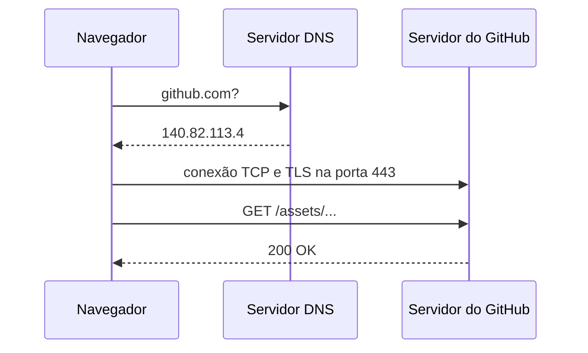

## O caminho de uma requisição



## Evidência do DNS

```text
Servidor: UnKnown
Address: 2804:14d:1:0:181:213:132:2

Nome: github.com
Address: 140.82.113.4
```

## Evidência do HTTP

| Método | Recurso | Status |
|---|---|---|
| GET | 3d-ec86cb9f5ad031d6.js | 200 OK |
| GET | a13-abe997f15620637c.js | 200 OK |
| GET | dg7-00dd475bea863874.js | 200 OK |
| GET | 93-5e7dbbd2ad5a789d.js | 200 OK |
| GET | /assets/react-376ca33a9466664f.js | 200 OK |

### Headers observados

```text
:authority: github.githubassets.com
:method: GET
:path: /assets/react-376ca33a9466664f.js
:scheme: https
Accept: */*
Accept-Encoding: gzip, deflate, br, zstd
Cache-Control: no-cache
Origin: https://github.com
Pragma: no-cache
Referer: https://github.com/rafaelcbrl/Clinica-vida
Sec-Fetch-Dest: script
Sec-Fetch-Mode: cors
Sec-Fetch-Site: cross-site
```